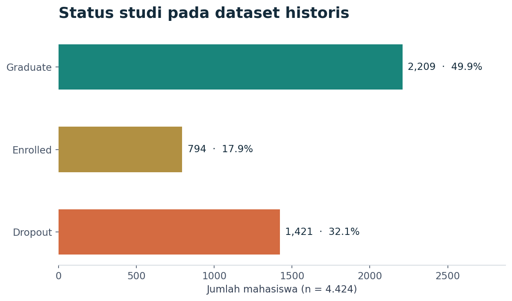
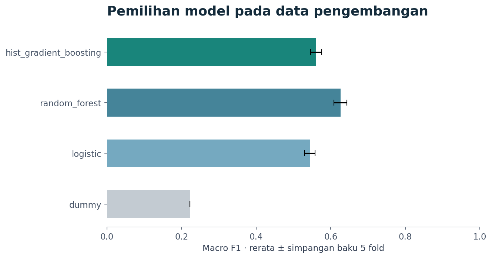
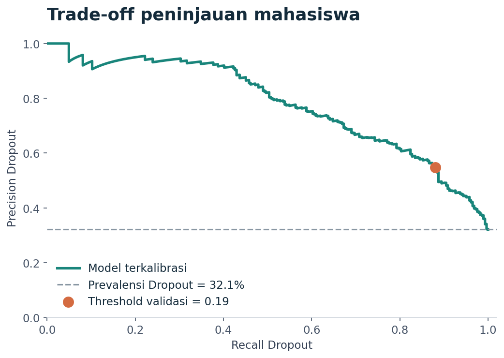

# Student Success — Semester-One Outcome Prediction

Studi kasus Data Science untuk memahami status studi mahasiswa dan membantu prioritas peninjauan menggunakan informasi sampai **akhir semester 1**.

**14 fitur · 3 kelas · validasi terpisah · probabilitas terkalibrasi · dashboard Streamlit**

Proyek ini berkembang dari submission Dicoding dengan konteks Jaya Jaya Institut (fiktif). Versi portofolio mempertajam waktu prediksi, memperbaiki evaluasi dan validasi input, serta menyatukan analisis dan prediksi dalam satu aplikasi.

> Model merupakan demonstrasi prediksi retrospektif. Dataset tidak memiliki tanggal dropout per mahasiswa; hasil tidak membuktikan bahwa setiap prediksi dibuat sebelum kejadian. Enrolled bukan jaminan lulus atau bebas risiko.



## Apa yang dapat dilakukan

- Menjelajahi data historis dengan filter program studi dan usia.
- Memasukkan profil semester 1 dengan label kategori dan skala yang jelas.
- Memvalidasi serta memprediksi CSV secara batch; mengunduh hasil dengan source_row.
- Melihat probabilitas tiga kelas dan satu kategori peninjauan yang konsisten.
- Memeriksa performa, calibration curve, trade-off peninjauan, dan keterbatasan.

## Desain studi kasus

| Aspek | Keputusan |
|---|---|
| Target | Dropout / Enrolled / Graduate pada akhir durasi normal program |
| Skenario | Fitur pendaftaran + hasil semester 1 |
| Fitur dikeluarkan | Semester 2, status finansial/makro yang timing-nya belum jelas, gender/kebangsaan dan atribut keluarga; usia tetap digunakan |
| Pemilihan model | Mean macro F1 pada 5-fold CV, hanya data development |
| Kalibrasi | Sigmoid 3-fold di dalam training |
| Threshold | Maksimalkan F2 pada policy validation, terpisah dari seleksi model |
| Output tindakan | Perlu peninjauan / Pemantauan rutin; ditentukan oleh P(Dropout) |
| Penggunaan | Pendampingan oleh manusia, bukan keputusan akademik otomatis |

Detail: [Business case](docs/BUSINESS_CASE.md) · [Data card](docs/DATA_CARD.md) · [Kamus fitur](docs/FEATURE_DICTIONARY.md).

## Hasil yang diperoleh

Model terpilih: **random_forest**, dengan threshold **0.19**.

| Metrik holdout historis (n = 885) | Nilai |
|---|---:|
| Accuracy multiclass | 70.85% |
| Macro F1 | 0.6129 |
| Weighted F1 | 0.6904 |
| Recall Dropout pada kebijakan peninjauan | 88.03% |
| Precision pada kebijakan peninjauan | 54.82% |
| Proporsi profil yang ditandai | 51.53% |
| Dropout average precision | 0.7788 |

Kebijakan mengenali **250 dari 284** kasus Dropout, melewatkan **34**, dan menghasilkan **206** false positive. Total **456 profil** perlu ditinjau. Recall tinggi disertai beban peninjauan besar; kapasitas institusi nyata belum ditetapkan.

**Evaluasi ini memakai holdout historis yang pernah dilihat pada submission.** Hasil bukan validasi eksternal independen. Skor juga tidak dibandingkan langsung sebagai peningkatan terhadap model lama yang memakai fitur semester 2 dan finansial.




[Model card](docs/MODEL_CARD.md) memuat interval, kelemahan per kelas, error kelompok, dan batas penggunaan. Hasil terstruktur tersedia pada `reports/metrics.json`.

## Mulai dalam lingkungan lokal

Gunakan **Python 3.12**. Di root repository:

```bash
python -m venv .venv
```

Aktifkan environment dengan `.venv\Scripts\activate.bat` (Windows Command Prompt), `.\.venv\Scripts\Activate.ps1` (PowerShell), atau `source .venv/bin/activate` (Linux/macOS), kemudian:

```bash
python -m pip install -r requirements.txt
streamlit run app.py
```

Model terlatih sudah disertakan. Contoh CSV sintetis ada di `examples/students_template.csv`. Instal versi dependensi yang sesuai karena model memeriksa versi scikit-learn saat dimuat.

## Training, notebook, dan pengujian

```bash
python -m student_success.train
python scripts/build_notebook.py
python -m unittest discover -s tests -v
```

Builder notebook menjalankan training kembali dan menghasilkan `notebook.ipynb` dengan output nyata. Untuk Jupyter:

```bash
python -m pip install -r requirements-notebook.txt
jupyter lab notebook.ipynb
```

Notebook yang disertakan sudah dieksekusi: **41 sel, 28 sel kode**. [Protokol reproduksi](docs/REPRODUCIBILITY.md) menjelaskan alur, file keluaran, dan batas environment. [Catatan verifikasi](docs/VALIDATION.md) membedakan pemeriksaan yang lulus dan pengujian UI yang masih perlu dijalankan pada environment dengan Streamlit.

## Struktur repository

| Path | Peran |
|---|---|
| `app.py` | Aplikasi Streamlit: dashboard, individu, batch, kinerja |
| `notebook.ipynb` | Narasi analisis dan alur training yang sudah dijalankan |
| `student_success/` | Schema, pipeline, training, inference, figur |
| `data/raw/` | Snapshot dataset asli, checksum tetap |
| `artifacts/` | Model terkalibrasi, manifest, schema |
| `reports/` | Split, CV, evaluasi, prediksi, diagnostik dan figur |
| `examples/` | CSV sintetis untuk demonstrasi |
| `tests/` | Kontrak data/artefak dan pengujian Streamlit |
| `docs/` | Business/data/model card, migrasi, verifikasi |
| `scripts/` | Builder notebook dan dokumentasi |
| `.github/workflows/` | CI pada main dan pull request |

## Deployment dan arsip

Versi portofolio menggunakan entrypoint `app.py` dan Python 3.12 pada Streamlit Community Cloud. Tautan demo baru ditambahkan setelah deployment berhasil; paket ini tidak mengubah deployment lama.

Original submission: [branch dicoding-submission](https://github.com/mpnabil95/Students-Performance/tree/dicoding-submission) · [release arsip](https://github.com/mpnabil95/Students-Performance/releases/tag/dicoding-submission-v1.0.0).

Ikuti [panduan migrasi](docs/MIGRATION.md) untuk mengganti isi main tanpa mengubah arsip. [Penyelesaian temuan audit](docs/AUDIT_REMEDIATION.md) menjelaskan perubahan dari baseline.

## Sumber, lisensi, dan atribusi

- Konteks pembelajaran: Dicoding, Penerapan Data Science — Menyelesaikan Permasalahan Institusi Pendidikan.
- Dataset: [Dicoding Academy](https://github.com/dicodingacademy/dicoding_dataset/tree/main/students_performance), bersumber dari [UCI](https://doi.org/10.24432/C5MC89).
- Realinho, V., Vieira Martins, M., Machado, J., & Baptista, L. (2021). *Predict Students' Dropout and Academic Success*. UCI Machine Learning Repository.
- Kode: [MIT License](LICENSE). Dataset: CC BY 4.0 sesuai sumber UCI; atribusi data tetap berlaku.
- Pengembang: **Muhammad Pangeran Nabil**.
